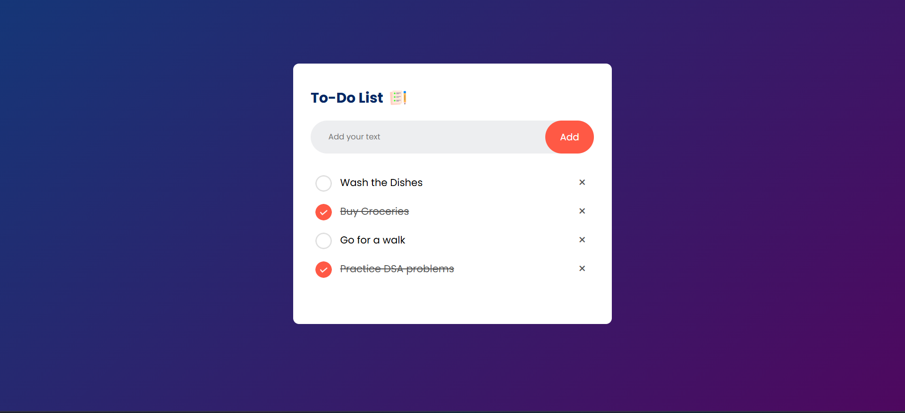

# 📝 To-Do List App

A simple and interactive To-Do List application that helps users manage their daily tasks efficiently. This app stores tasks in **local storage**, ensuring that the list remains even after refreshing the page or closing the browser.

## 🚀 Features

- 📌 **Add tasks**: Enter a task and click the "Add" button to add it to the list.
- ✅ **Mark tasks as completed**: Click on a task to mark it as done.
- ❌ **Remove tasks**: Click the "×" icon to delete a task.
- 💾 **Persistent Storage**: Tasks are saved in local storage, so they remain available even after the page is refreshed.
- 🎨 **Attractive UI**: A clean and modern user interface with a gradient background.

## 🖥️ Demo

## 🔧 Technologies Used

- **HTML5** 🏗️ (Structure)
- **CSS3** 🎨 (Styling)
- **JavaScript** ⚡ (Functionality & Local Storage)

## 📌 How to Use?

1. Clone or download the repository.
2. Open `index.html` in your browser.
3. Start adding your tasks in the input field and manage them easily.

## 🏗️ Future Enhancements

- 🗓️ **Add due dates for tasks**
- 🔔 **Set reminders for tasks**
- 📂 **Categorize tasks into different lists**
- ☁️ **Sync tasks with cloud storage**

⭐ If you like this project, feel free to contribute or leave a star!

